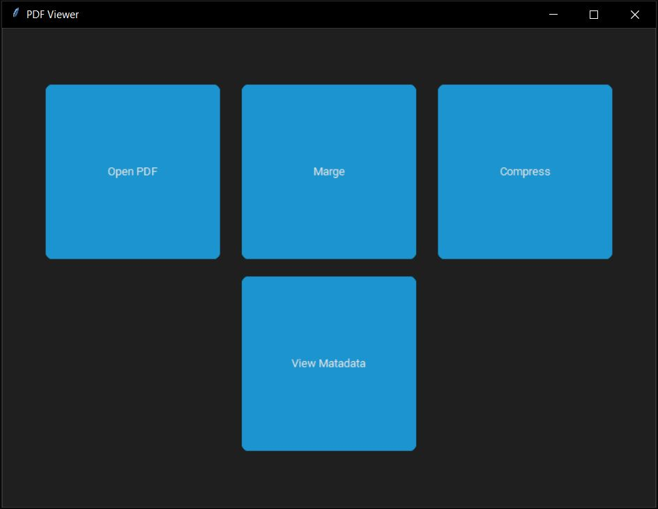
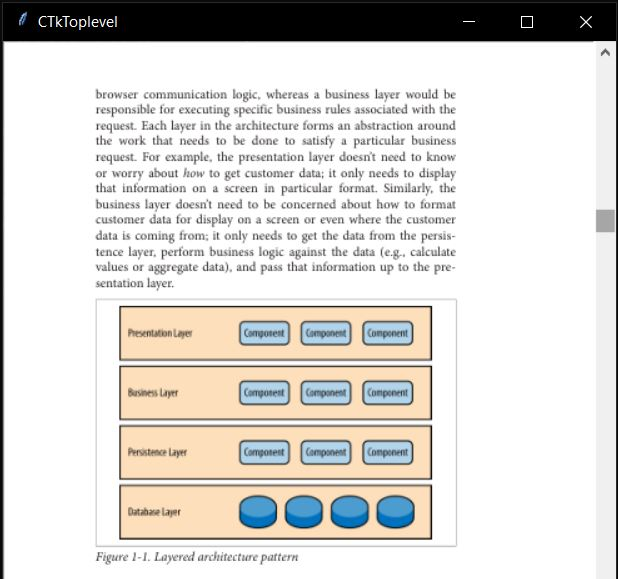
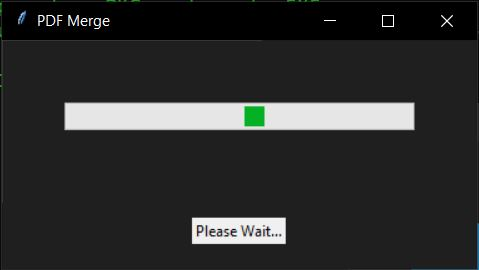
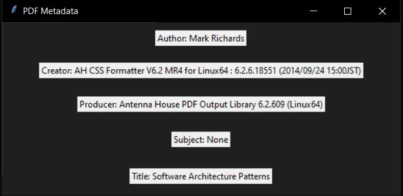

# Dependencies
<pre>
<code>
pip install customtkinter
pip install tkPDFViewer
pip install PyPDF2
</code>
</pre>

# Exe File
<a href="https://github.com/abdullahibnamin/PDFViewer/releases/download/v0.1.0/main.exe">Download</a>

# Images

Merge PDF

PDF MetaData

